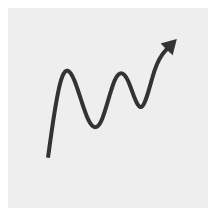

# &lt;trend-line&gt;

 [](https://www.webcomponents.org/element/trend-line)

Web component implementation of a trend-line.



## Usage

Import `trend-line` and set CSS custom properties:

```html
<head>
  <script type="module">
    import "https://cdn.skypack.dev/@nextbitlabs/trend-line";
  </script>
  <style>
    /*
      CSS custom properties penetrate the Shadow DOM.
      They are useful to provide custom styling.
    */
    trend-line {
      --color: #333; /* default black */
      --stroke-width: 2px; /* default 2px */
      --background: #eee; /* default transparent */
    }
  </style>
</head>
```

Use the custom element:

```html
<body>
  <trend-line
    x-interval="[0, 10]"
    y-interval="[0, 1]"
    width="100"
    height="100"
    margin="20"
  ></trend-line>
</body>
```

Set the data to plot:

```html
<script>
  const element = document.querySelector("trend-line");
  element.data = [[1, 3], [2, 5], [3, 2]];
</script>
```

Please have a look at the [demo](https://github.com/nextbitlabs/trend-line/blob/main/demo/index.html) in the repo, or the live [demo](https://pp41i.csb.app/).

## License

MIT
